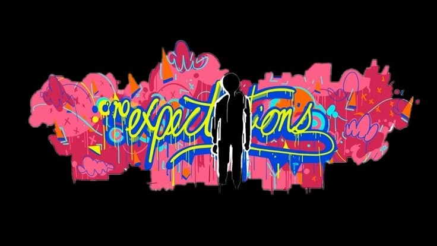

<!-- ==================== BANNER ==================== -->

  

<h1 align="center">Shaik Muhammad Awaiz</h1>

  <em>Full Stack Developer &nbsp;•&nbsp; AI / ML Engineer &nbsp;•&nbsp; Systems Tinkerer</em>

  

  &nbsp;
  &nbsp;
  

  
  &nbsp;
  

<!-- ==================== ABOUT ==================== -->
## &nbsp;`$ whoami`

<table>
<tr>
<td width="220" valign="top">
  
</td>
<td valign="top">

Hey — I'm **Awaiz**, a B.Tech CSE (AI/ML) student at **G. Pulla Reddy Engineering College, Kurnool**, and a full stack developer who keeps drifting toward the harder half of the stack.

Most of what I build sits where **web engineering meets applied AI**: React and Node on the front, FastAPI and Python on the back, and LLMs, RAG pipelines and multi-agent systems doing the interesting work in the middle. Lately I've been going lower — writing **Rust** for a transactional Linux shell with verifier-checked undo plans, and designing recoverability-first storage semantics for the C-DAC / MeitY **AI-Enabled OS Hackathon 2026**.

Currently building **Erus Academy**, an AI-assisted learning platform at **Wedevit.in**.

I ship fast, break things on purpose, and read the stack trace instead of guessing.

 

`🌐` Portfolio &nbsp;→&nbsp; **[shaikawaiz.wedevit.in](https://shaikawaiz.wedevit.in)**
`🔭` Building &nbsp;→&nbsp; Erus Academy — AI-assisted learning @ Wedevit.in
`🦀` Exploring &nbsp;→&nbsp; Rust, OS internals, agentic system design
`💬` Ask me about &nbsp;→&nbsp; React, Node, REST APIs, Generative AI, RAG, System Design
`⚡` Fun fact &nbsp;→&nbsp; I built a sign language detector that turns gestures into live captions on video calls 🤟
`🎯` Motto &nbsp;→&nbsp; *First, solve the problem. Then, write the code.*

</td>
</tr>
</table>

<!-- ==================== TECH STACK ==================== -->
## &nbsp;⚡ Tech Arsenal

<table>
<tr>
<td width="150" align="right"><b><code>Languages</code></b></td>
<td>
  
  
</td>
</tr>
<tr>
<td align="right"><b><code>Frontend</code></b></td>
<td>
  
</td>
</tr>
<tr>
<td align="right"><b><code>Backend &amp; Data</code></b></td>
<td>
  
</td>
</tr>
<tr>
<td align="right"><b><code>AI / ML</code></b></td>
<td>
  
  
  
   
  
  
  
</td>
</tr>
<tr>
<td align="right"><b><code>DevOps &amp; Tools</code></b></td>
<td>
  
  
  
</td>
</tr>
</table>

<!-- ==================== PROJECTS ==================== -->
## &nbsp;🚀 Featured Work

<table>
<tr>
<td width="50%" valign="top">

### [🦀 SafeShell](https://github.com/shaik2501/SafeShell)
`Rust` &nbsp;·&nbsp; **C-DAC AI-Enabled OS Hackathon 2026**

Transactional Linux command execution. Every command is simulated before it runs, and an AI-generated **undo plan** is checked by a verifier before it's trusted — so a bad `rm` is recoverable instead of fatal.

</td>
<td width="50%" valign="top">

### [🗄️ Intent-Store](https://github.com/shaik2501/Intent-Store)
`TypeScript` &nbsp;·&nbsp; **C-DAC AI-Enabled OS Hackathon 2026**

Recoverability-first semantic storage intelligence — the filesystem understands *why* data was written, not just where, and uses that intent to make recovery a first-class operation.

</td>
</tr>
<tr>
<td valign="top">

### [🧠 Curator — ResearchCrew](https://github.com/shaik2501/Curator-Multi-agent-system-)
`TypeScript` &nbsp;·&nbsp; `Multi-Agent`

You give it a research goal; a supervisor agent plans and delegates to web-research, data, coding and critic agents. They argue it out and stream a fully cited markdown report live to a dashboard.

</td>
<td valign="top">

### [📦 SETU — Supply Chain Copilot](https://github.com/shaik2501/ForeStock)
`Next.js` &nbsp;·&nbsp; **MSME Idea Hackathon 6.0**

A WhatsApp-first demand-forecasting and supplier-matchmaking platform that lets a 5-person MSME run its supply chain like an enterprise. Zero new hardware, zero training.

</td>
</tr>
<tr>
<td valign="top">

### [🛡️ Active Guardian](https://github.com/shaik2501/Active_Guardian)
`MERN` &nbsp;·&nbsp; **MSME Idea Hackathon 6.0**

An autonomous resilience engine for coastal and hilly MSMEs — predicts climate threats, alerts stakeholders, and reroutes supply chains automatically before the disruption lands.

</td>
<td valign="top">

### [🎨 MyDesigns](https://github.com/shaik2501/MyDesigns)
`Design Blueprints` &nbsp;·&nbsp; `Open Source`

An open-source collection of reusable design blueprints and visual references — a growing home for interface ideas, layouts, and design inspiration.

</td>
</tr>
</table>

<!-- ==================== STATS ==================== -->
## &nbsp;📊 GitHub Analytics

  

<!--
  NOTE ON CONTRIBUTION CHARTS
  ghchart.rshah.org was removed: it reported 12 contributions across 6 days when the
  real figure was 136, and its base cell colour is #EEEEEE, which renders as a white
  slab on a dark README. GitHub already shows the real contribution graph directly
  above this README on the profile page, so the snake below is the only one worth having.

  NOTE ON STATS CARDS
  The public github-readme-stats instance (github-readme-stats.vercel.app) currently
  returns 503 for everyone — it is permanently over its rate limit — and the activity-graph
  and trophy instances return 402. That is why those cards are not used here.

  To get the classic stats / top-languages cards back, deploy your OWN instance:
    1. Fork https://github.com/anuraghazra/github-readme-stats
    2. Deploy it to Vercel (free) and add a PAT_1 env var with a GitHub token
    3. Uncomment the block below and replace YOUR-INSTANCE with your Vercel domain

  

    
    
  

-->

<!-- ==================== SNAKE ==================== -->
<h3 align="center">🐍 Watch my contributions get eaten</h3>

  <picture>
    <source media="(prefers-color-scheme: dark)" srcset="./dist/github-snake-dark.svg" />
    <source media="(prefers-color-scheme: light)" srcset="./dist/github-snake.svg" />
    
  </picture>

<!-- ==================== CONNECT ==================== -->
<h2 align="center">💬 Let's build something with no expectations</h2>

  Open to collaborations, hackathon teams, and internships in full stack &amp; applied AI.

  

  
  &nbsp;
  

  <i>“First, solve the problem. Then, write the code.”</i>

